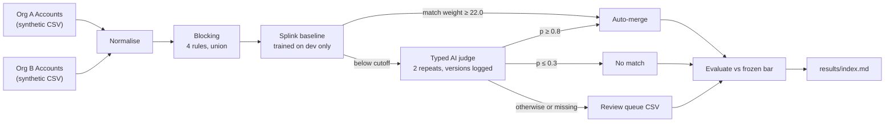

# CRM Salesforce Account Reconciliation Lab

A synthetic Salesforce Account reconciliation experiment comparing a probabilistic baseline with an AI-assisted cascade.

Final result: **v1 KILL** — the experiment failed its frozen acceptance gate on calibration. Eight of nine criteria passed; the acceptance bar was preserved. A successful evidence verification reproduces this result.

CI is configured in `.github/workflows/ci.yml`; see [CI](#ci). The v1 experiment verdict and CI verification status are separate.

## Start here

| What you want to do | Where to start |
|---|---|
| Understand the problem and findings | [Executive overview](#executive-overview) and [results vs the frozen bar](#results-vs-the-frozen-bar) |
| Review pairs and explore recorded failures | [Local synthetic review workbench](docs/review-workbench.md) |
| See how individual Accounts are routed | [Three recorded decision examples](docs/decision-examples.md) |
| Try the demo without an API key | [Five-minute visitor walkthrough](docs/visitor-walkthrough.md) |
| Inspect the failure and underlying evidence | [Calibration table](results/calibration.md), [review queue](results/review_queue.csv), and [published report](results/index.md) |

The cascade recommends merge, no match, or human review for synthetic record pairs. It does not connect to Salesforce or merge live Accounts.

## Executive overview

This lab reproduces a common CRM merger problem: two Salesforce orgs hold overlapping Account records, and the job is to find the duplicates without merging companies that only look alike. Both orgs here are synthetic: 1,000 Accounts each, 250 shared companies, seeded intra-org duplicates, domain variants, conflicting fields and 75 hard look-alikes, exported in Salesforce column shape.

The pipeline blocks candidate pairs, scores them with a Splink probabilistic baseline, and sends every pair Splink will not auto-merge to a typed AI judge whose answers are parsed, logged and versioned. The pass bar and all cutoffs were frozen and pushed in commit `2fd9d16` before the one published run on a held-out test seed; the results are in commit `3af53c8`.

Headline numbers on the test seed: blocking recall 0.997; Splink alone auto-merged with precision 0.996 but recall 0.688; with the AI judge, auto-merge precision was 0.988 (Wilson 95% lower bound 0.971) and recall 0.966, leaving 21 of 1,648 candidate pairs for human review. On a corruption type never seen in development, recall was 0.795 versus 0.026 for Splink alone. Estimated spend for the run was $0.32.

The verdict is an honest **KILL**: eight of nine criteria passed, but calibration failed. In plain terms, the model was slightly underconfident at the extremes: when it said about 1% or 96%, the true rates were 0% and 100%. The bar was not changed after the run.

## Results vs the frozen bar

Test seed 202, published run `published-202-2fd9d168`. All figures are from [`results/metrics.json`](results/metrics.json); details are in [`results/index.md`](results/index.md).

| # | Criterion | Frozen bar | Result | |
|---|---|---|---|---|
| 1 | Blocking recall | ≥ 0.98 | 0.997 (352/353) | pass |
| 2 | Auto-merge precision | ≥ 0.98, Wilson low ≥ 0.96 | 0.988 (341/345), Wilson low 0.971 | pass |
| 3 | Auto-merge recall | ≥ 0.85 | 0.966 (341/353) | pass |
| 4 | Review queue | ≤ 10% of candidates and ≤ 300 | 21 pairs (1.3% of 1,648) | pass |
| 5 | Beats Splink-only | recall +0.05, or review ≤ 0.7× at equal reachable recall | recall +0.278 (0.966 vs 0.688) | pass |
| 6 | Calibration | ≥ 80% of measured bins met, max gap ≤ 0.10 | 0 of 2 measured bins met; max gap 0.036 | **FAIL** |
| 7 | Answers and versions | missing ≤ 2%, 100% versioned, log valid | 0/3,308 missing; 100% versioned; valid | pass |
| 8 | Unseen-family recall | ≥ 0.75 | 0.795 (31/39); Splink-only 0.026 | pass |
| 9 | Published-run spend | ≤ $10 | $0.3222 (estimated) | pass |

Frozen cutoffs (chosen on dev seed 101 by rules committed before any AI call): Splink auto-merge at match weight ≥ 22.0; AI merge at p ≥ 0.8; AI no-match at p ≤ 0.3. Calibration detail: in the lowest bin (1,275 answers) the mean stated probability was 0.012 and the observed match rate 0.000; in the top bin (176 answers) it was 0.964 against 1.000. Both gaps are small but statistically significant at those sample sizes, and the other eight bins had fewer than 30 answers each, so they were not measured. Total estimated spend across development and the published run: $0.6126.

## Pipeline



## How to reproduce

Requires Python 3.11 or later. Start in the repository root. For Windows PowerShell commands, expected output, and troubleshooting, use the [visitor walkthrough](docs/visitor-walkthrough.md).

```bash
python -m venv .venv && . .venv/bin/activate
pip install -e ".[dev]"
scripts/ci_local.sh                  # boundary check, offline tests, gitleaks if installed
python -m recon_lab.cli verify       # read-only replay of the committed published evidence
```

Verification exits zero when the committed evidence reproduces consistently, including its **KILL** verdict. It exits nonzero on missing, malformed, altered or inconsistent evidence. It checks frozen hashes for both seeds, call coverage and raw-answer parsing, model-version logs, token-derived estimated spend, decision ledgers, all metrics and frozen criteria, the review queue, and both results pages. Replay files are written only in a temporary directory; no API key or provider call is needed.

This is a consistency audit, not proof of provider authenticity or an immutable execution environment. The original v1 freeze does not hash pipeline source or all dependencies, and the raw logs are not independently signed. The verifier does not change that historical limitation or reinterpret the calibration criterion.

The following commands rebuild development inputs and write files; they are not required to verify the published result:

```bash
python -m recon_lab.cli generate     # rebuilds data/ for seeds 101 and 202 (deterministic)
python -m recon_lab.cli train-baseline
```

The committed results can be checked without any model call: the data, Splink model, prompt and rules are hashed in `config/frozen/protocol.json`, and every judge answer is in `runs/published-202-2fd9d168/calls.jsonl`. Re-running the judge (`dev`, `freeze`, `publish`) needs `OPENAI_API_KEY` in the environment (it is never logged) and would be a new run: the published run is one-shot and refuses to overwrite itself.

## Budget admission for new runs

Each provider attempt reserves its configured worst-case token cost before dispatch. Admission includes actual estimated spend and every outstanding reservation in the shared `SpendLedger`. Settlement replaces the reservation with reported usage; the phase cap remains inclusive and the cumulative stop line (bounded by the hard ceiling) remains strict. Once a client encounters budget denial, its remaining requests are marked `not_called_spend_cap`, preserving the existing stop behavior.

Automatic SDK retries are disabled: one admitted request makes at most one provider attempt. API/transport errors, cancellation after admission, and absent or invalid usage retain their reservation because billable usage is uncertain. The pipeline flushes the ledger even on cancellation, recording these amounts separately as `unresolved_reserved_usd` and `unresolved_calls`; subsequent runs include them in admission, without treating them as measured spend or silently releasing them. Existing spend records without those fields remain readable.

This protects calls sharing one ledger in one process. It is not a cross-process lock or crash-durable reservation journal. Cost remains an estimate: input uses the configured token allowance and prices, while output uses the configured completion limit. Reported usage above the reservation is recorded in full and can exhaust the budget; this does not guarantee a provider billing ceiling. The historical frozen protocol, inputs, prompt, model, logs, and published results are unchanged.

## Repo layout

| Path | What it holds |
|---|---|
| `src/recon_lab/generate.py` | Synthetic two-org generator and corruption model (Salesforce columns, 18-char Ids) |
| `src/recon_lab/normalize.py`, `blocking.py` | Normalisation and the four blocking rules |
| `src/recon_lab/baseline.py` | Splink 4.0.17 baseline (DuckDB) |
| `src/recon_lab/judge.py`, `prompts/account_match.v1.md` | Typed AI judge, spend ledger, and the published prompt (sha256 in every run log) |
| `src/recon_lab/decide.py`, `evaluate.py`, `report.py` | Cutoff selection, cascade, metrics with Wilson bounds, bar check, results page |
| `src/recon_lab/verify.py` | Read-only offline replay and consistency audit of published v1 evidence |
| `src/recon_lab/vendor/crashlab/` | Measurement modules vendored from Agent-Crash-Lab @ 8a3f865 (see `VENDORED.md`) |
| `config/protocol_rules.json` | Bar and selection rules, committed before any AI call |
| `config/frozen/` | Frozen protocol (cutoffs and hashes) and the dev-trained Splink model |
| `data/` | Synthetic exports and ground truth for seeds 101 and 202 |
| `runs/` | Probe, dev and published run logs, model-version logs, decision ledgers, spend ledger |
| `results/` | Results page, metrics, review queue, calibration table |
| `scripts/` | `boundary_check.py` and `ci_local.sh` |
| `.github/workflows/ci.yml` | Push/PR checks: boundary, offline tests and published evidence verification, gitleaks |
| `tests/` | Unit tests, including the vendored modules' tests |

## Pre-registration

1. `config/protocol_rules.json` was committed before any AI call. It holds the bar, the cutoff-selection rules, the caps, and the prompt and model settings.
2. The dev run on seed 101 picked the cutoffs by those rules (`runs/dev_selection.json`).
3. `config/frozen/protocol.json` records the cutoffs plus sha256 of the rules, prompt, Splink model and test data. It was committed and pushed in `2fd9d16` before the published run. The run refuses to start if that file is uncommitted, not on `origin/main`, or if any hashed input changed.
4. One published run on seed 202, results in `3af53c8`. There is no re-run on the same seed, and v1 is the final result.

## Limitations

- **Synthetic data only.** The ground truth is circular: this repo wrote the corruption model it is scored on. The unseen corruption family in the test seed is only a partial mitigation. Nothing here measures real CRM data, production readiness, or any vendor.
- **Reliance on names.** When names were replaced with consistent random tokens (300-pair sample, 23 true pairs), recall fell from 0.826 to 0.478. The pre-registered rule flags a drop of more than 25 points; it is not a kill criterion. Websites were not disguised.
- **Alias-only model version.** The requested model `gpt-6-luna` came back as `gpt-6-luna` on all 3,308 calls. No dated snapshot was returned, so the version log pins an alias, not an immutable snapshot.
- **Spend is an estimate.** It is computed from token usage at the list price ($0.10 / $0.50 per 1M input / output tokens, with cached input charged at full price). It has not been reconciled with a provider invoice.
- **Design choices.** Splink's probabilities were nearly all near 0 or 1, so the AI judges every candidate below the Splink cutoff rather than a narrow probability band. Generator difficulty was raised once, before any AI call, after a baseline-only check gave perfect scores.

## CI

The GitHub Actions workflow at `.github/workflows/ci.yml` runs on pushes and pull requests with read-only repository permissions. It runs the boundary check, offline unit tests, published evidence verification, and gitleaks. The test and verification steps set `OPENAI_API_KEY` to an empty string and do not run the judge. A green verification check confirms that the published **KILL** result is reproducible; it does not turn the experiment into a PASS.

`scripts/ci_local.sh` runs the same checks locally, skipping gitleaks only when it is not installed. The boundary check fails on private project names and on any email or URL whose domain is not `.example` or `.invalid`, and it scans every tracked text file.

## Provenance

> **Provenance (written 2026-10-02, ET).** I designed and built this repository on 2026-10-02 as a personal portfolio project. All data here is synthetic, generated by `src/recon_lab/generate.py` from fixed seeds, and contains no real customer, company, or personal data. Company names come from fictional word lists. All websites and emails use the reserved `.example` domain (RFC 2606), and phone numbers use the fictional 555-0100–0199 range. The workflow idea draws only on publicly available descriptions of multi-CRM consolidation. No confidential, non-public, recruiter-provided, interview, or take-home material from any company was used. The measurement modules in `src/recon_lab/vendor/crashlab/` are copied from Agent-Crash-Lab (MIT) at commit 8a3f865; see that folder's LICENSE and VENDORED.md. This is a demonstration, not a product, and it is not affiliated with or endorsed by Salesforce, Snowflake, dbt Labs, or any other vendor.

## Licence

- This repository: MIT, see [`LICENSE`](LICENSE) (Copyright (c) 2026 B Gee).
- Vendored measurement modules in `src/recon_lab/vendor/crashlab/`: MIT, under their own [`LICENSE`](src/recon_lab/vendor/crashlab/LICENSE), reproduced verbatim from Agent-Crash-Lab @ 8a3f865 (see `VENDORED.md`).
